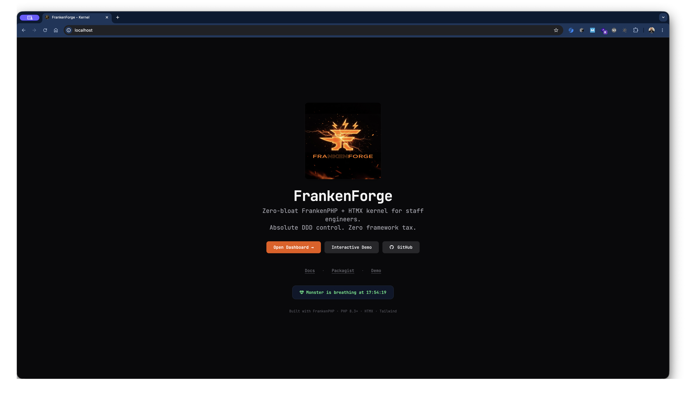
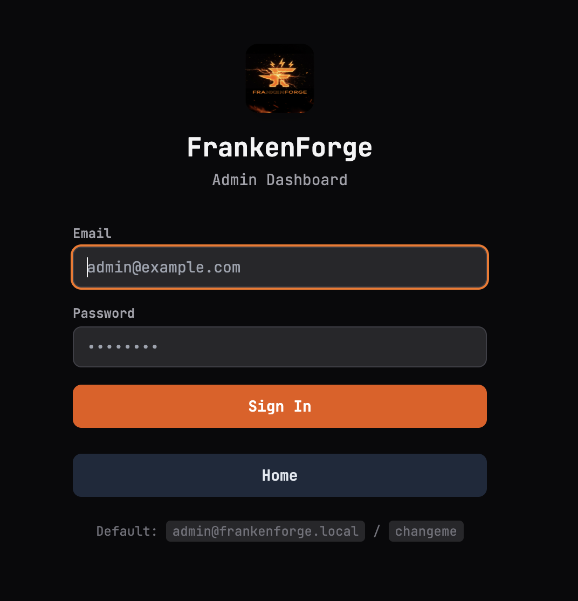
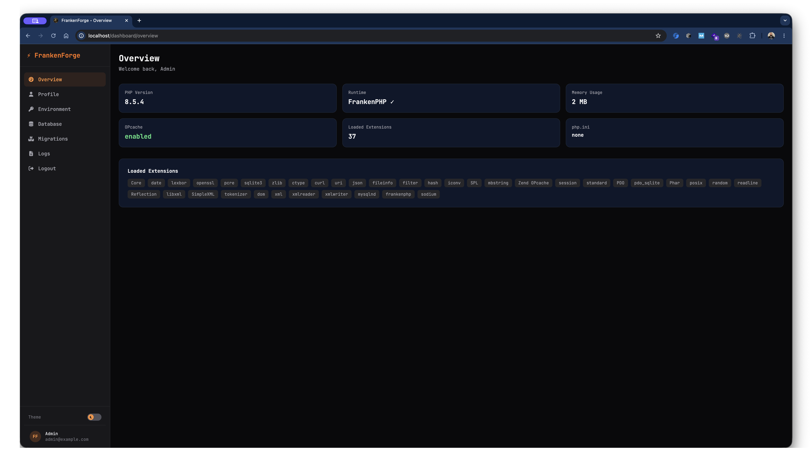
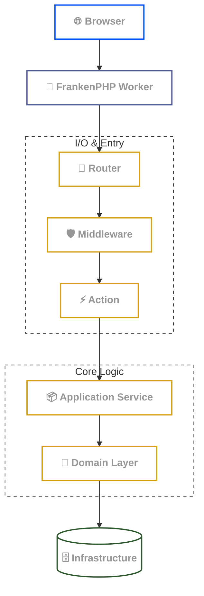

<div align="center">


# FrankenForge

**Minimal FrankenPHP worker-mode kernel for building HTMX-first applications in raw PHP 8.3**

Persistent runtime • Explicit architecture • No framework boot cycle

[](https://php.net)
[](https://frankenphp.dev)
[](https://htmx.org)
[](https://tailwindcss.com)
[](LICENSE)
[](ROADMAP.md)

</div>

---

## What is FrankenForge?

FrankenForge is a lightweight backend kernel designed around **FrankenPHP worker mode**.

Instead of bootstrapping an entire framework on every request, FrankenForge keeps your application container, configuration, and services resident in memory while handling fresh requests inside a persistent worker loop.

It combines:

- **FrankenPHP** for persistent PHP workers
- **HTMX** for server-driven interactivity
- **Raw PHP templates** for rendering
- **DDD-friendly structure** for maintainable applications
- **Minimal abstractions** and explicit dependency wiring

The goal is simple:

> Give developers a fast and structured backend foundation without hiding application behavior behind deep framework layers.

---

## Status

FrankenForge is currently in beta.

The core runtime and demo application are functional and usable for experimentation, internal tools, and lightweight applications, but APIs and internal conventions may still evolve.

Feedback and contributions are welcome.

---

## Why FrankenForge?

### Persistent Runtime

Traditional PHP applications restart large parts of the application lifecycle for every request.

FrankenForge uses FrankenPHP worker mode:

```txt
Worker boots once
 ├── Container
 ├── Config
 ├── Database connection
 └── Shared services

Each request:
 ├── Fresh Request object
 ├── Fresh Response object
 └── Route dispatch
```

This reduces:
- repeated bootstrapping
- runtime overhead
- unnecessary allocations

---

### HTMX-first Development

FrankenForge is designed around server-rendered HTML and hypermedia interactions.

You can build:
- dashboards
- admin panels
- internal tools
- lightweight SaaS products
- JSON APIs

without introducing:
- SPA complexity
- frontend build pipelines
- Node.js runtimes

---

### Explicit Architecture

FrankenForge favors:
- constructor injection
- stateless services
- immutable entities
- isolated domain logic
- readable request flow

No magic containers. No hidden runtime behavior.

---

## Quick Start

### Install

```bash
composer create-project ldaidone/frankenforge my-app
```

### Start the application

```bash
cp .env.example .env
touch storage/app.db

make dev
make migrate_up
make seed
```

Open:

```txt
http://localhost
```



Default login:

```txt
admin@frankenforge.dev
changeme
```

<div align="center">
    
</div>

---

## Included Demo Application

FrankenForge ships with a complete demo/showcase application to help developers explore the architecture and runtime model quickly.

### Admin Dashboard



Included features:

- Authentication
- Profile management
- Database browser
- Migration runner
- Environment editor
- Log viewer
- HTMX-powered dashboard widgets
- Server-sent events (SSE)
- Flash messages
- JSON API endpoints

The demo is intentionally practical and designed as:
- a learning resource
- a reference architecture
- a real starting point for internal tools

---

## Architecture Overview


### Core Principles

| Principle | Description |
|---|---|
| Explicit DI | Dependencies wired manually through constructors |
| Stateless services | Shared safely across requests |
| Immutable entities | Domain entities use readonly structures |
| Isolated domains | Business logic separated from infrastructure |
| Worker-aware design | Runtime optimized for persistent execution |

---

## Project Structure

```txt
src/
├── Core/          # Reusable kernel components
├── Domains/       # Application domains
└── Shared/        # Shared infrastructure
```

### Kernel Components

| Component | Purpose |
|---|---|
| Container | Lightweight dependency injection |
| Router | FastRoute-based dispatcher |
| Request / Response | HTTP abstraction |
| View | Native PHP templating |
| Validator | Request validation |
| Responder | HTML / HTMX / JSON negotiation |
| CSRF | Session-bound token protection |
| Logging | JSON-line logger |
| ErrorHandler | Error rendering |

---

## Example Worker Loop

```php
while (frankenphp_handle_request(function () use ($container): void {
    session_start();

    $container
        ->get('router')
        ->dispatch();
})) {
    // Application boot happens once
}
```

---

## Included Tooling

### Development Commands

```bash
make dev
make stop
make shell
make test

make migrate_up
make migrate_down
make migrate_status

make seed
make clean
```

### Manual CLI

```bash
php bin/migrate.php up
php bin/migrate.php down
php bin/migrate.php status

php bin/seed.php all -f
```

---

## Technology Stack

| Component | Choice | Why |
|---|---|---|
| Runtime | **FrankenPHP** (worker mode) | Persistent in-memory state, no per-request bootstrapping |
| Language | **PHP 8.3+** | Typed properties, readonly classes, enums, named arguments |
| Routing | **nikic/fast-route** | Fast, simple, no magic — just route matching |
| Templating | **Native PHP** (output buffering) | No learning curve, no compilation step, maximum performance |
| Frontend | **HTMX 2** | Server-rendered HTML, hypermedia-driven interactivity |
| Styling | **Tailwind CSS 4** (CDN) | Utility-first, no build step, no Node.js |
| Database | PDO-compatible (SQLite included by default) | Zero-config, WAL mode for concurrency, file-based |
| Auth | **Session-based** + Argon2id | Simple, secure, no external dependencies |
| Testing | **PHPUnit 13** | Standard PHP testing framework |

---

## Good Fit For

| Use FrankenForge if... | Probably not if... |
|---|---|
| You like explicit backend architecture | You want large plugin ecosystems |
| You enjoy server-rendered apps | You prefer SPA-first workflows |
| You want low runtime overhead | You prefer heavy convention systems |
| You like HTMX and hypermedia | You want full-stack frontend tooling |
| You want control over application structure | You want batteries-included frameworks |

---

## Philosophy

FrankenForge is not trying to replace every PHP framework.

It is optimized for developers who want:
- explicit control
- persistent runtimes
- low abstraction overhead
- server-driven applications
- understandable request flow

The project intentionally stays small, readable, and close to raw PHP.

---

## Contributing

Issues, discussions, and pull requests are welcome.

The project is still evolving and feedback is valuable — especially around:
- worker lifecycle patterns
- HTMX workflows
- performance
- developer experience
- architectural decisions

---

## Support

If you find FrankenForge useful, consider supporting the project:

[](https://www.buymeacoffee.com/leodaido)

---

<div align="center">

Built for developers who enjoy understanding their runtime.

</div>
